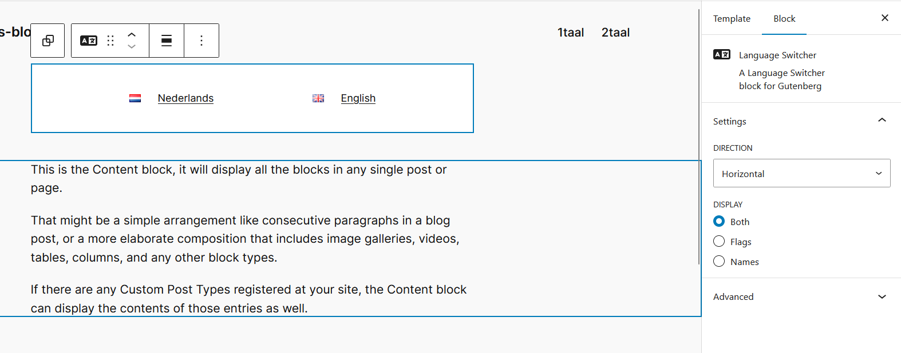
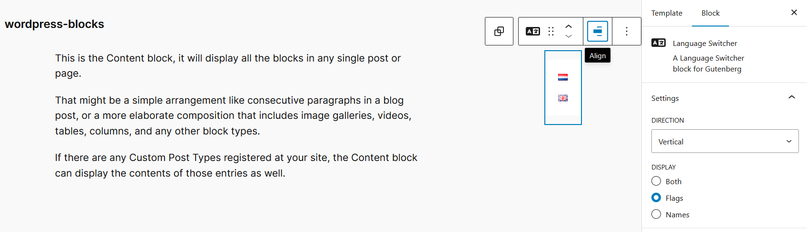

#  Language Switcher Block for WordPress

[](https://wordpress.org/)
[](https://php.net/)

A modern WordPress Gutenberg block that provides a customizable language switcher for multilingual websites. Uses the Polylang plugin to offer visitors an intuitive way to switch between available languages.

> [!WARNING]
> Until version 1.0 this will probably have bugs. If you encounter any please create an Issue.

## ✨ Features

- **🎨 Flexible Display Options**: Show language flags, names, or both
- **📱 Responsive Layout**: Choose between horizontal or vertical orientations
- **⚡ Modern Block Architecture**: Built with WordPress Block API v3
- **🔧 Easy Integration**: Seamless Polylang plugin integration
- **🎛️ Editor-Friendly**: Intuitive controls in the Gutenberg editor
- **♿ Accessibility Ready**: Semantic markup for screen readers

## 📷 Screenshots




## 📋 Requirements

- WordPress 6.7 or higher
- PHP 7.4 or higher
- [Polylang Plugin](https://wordpress.org/plugins/polylang/) (required dependency)

## 🚀 Installation

1. **Download**: Go to the [Releases page](../../releases) and download the latest `smb-language-switcher.zip` file

2. **Upload**: In your WordPress admin, go to **Plugins** → **Add New** → **Upload Plugin**

3. **Install**: Choose the downloaded ZIP file and click "Install Now"

4. **Activate**: Click "Activate Plugin" once the installation is complete

5. **Verify Polylang**: Make sure the Polylang plugin is installed and configured with your languages

## 🎯 Usage

1. **Add the Block**: In the Gutenberg editor, search for "Language Switcher" and add it to your post or page
2. **Configure Display**: Choose your preferred display options:
   - **Display**: Flags only, names only, or both
   - **Direction**: Horizontal or vertical layout
3. **Publish**: The language switcher will appear on the frontend for visitors

## ⚙️ Block Settings

| Setting | Options | Default | Description |
|---------|---------|---------|-------------|
| **Display** | `flags`, `names`, `both` | `both` | Choose what to display for each language |
| **Direction** | `horizontal`, `vertical` | `horizontal` | Layout orientation of language options |

## 🛠️ Development

### Prerequisites
- Node.js and npm
- WordPress development environment
- Polylang plugin installed and configured

### Setup for Development

1. **Clone the Repository**:
   ```bash
   cd wp-content/plugins/
   git clone [your-repo-url] language-switcher
   cd language-switcher
   ```

2. **Install Dependencies**:
   ```bash
   npm install
   ```

3. **Build the Plugin**:
   ```bash
   npm run build
   ```

### Build Commands

```bash
# Start development mode with hot reloading
npm run start

# Build for production
npm run build

# Lint JavaScript files
npm run lint:js

# Lint CSS files
npm run lint:css

# Format code
npm run format

# Create plugin ZIP file for release
npm run plugin-zip
```


## 🤝 Contributing

Contributions are welcome! Please feel free to submit a Pull Request. For major changes, please open an issue first to discuss what you would like to change.

1. Fork the repository
2. Create your feature branch (`git checkout -b feature/amazing-feature`)
3. Commit your changes (`git commit -m 'Add some amazing feature'`)
4. Push to the branch (`git push origin feature/amazing-feature`)
5. Open a Pull Request

## 🙏 Acknowledgments

- Built with [WordPress Block API](https://developer.wordpress.org/block-editor/)
- Integrates with [Polylang](https://wordpress.org/plugins/polylang/) by Chouby
- Icon from [Iconify](https://iconify.design/)
- Claude AI for creating this readme.

## 📞 Support

If you encounter any issues or have questions, please [open an issue](../../issues) on this repository.
